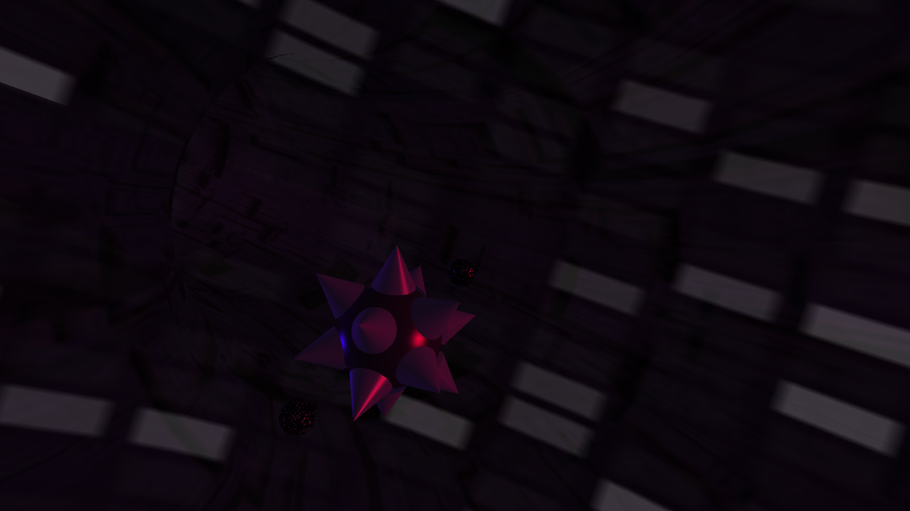

# GlutProject

Un proyecto para mostrar algunas de las características de la librería GLUT para OpenGL

| ℹ️ _Información General_   |                                 |
|--------------------------:|---------------------------------|
|             **APELLIDOS** | Gómez Alcañiz                   |
|                **NOMBRE** | Óscar                           |
|            **TITULACIÓN** | Grado en Ingeniería Informática |
| **PROFESOR DE PRACTICAS** | Arturo Beltrán                  |

## DESCRIPCIÓN DE EVENTOS

* tecla `l` → activa/desactiva las luces estáticas
* tecla `L` → activa/desactiva las luces dinámicas
* teclas `a`/`s` → cambiar textura de las bolas
* flechas (`UP`, `DOWN`, `LEFT`, `RIGHT`) → mover bola
* tecla `ESC` → salir del programa

## CARACTERÍSTICAS 

Descripción de las características más importantes del proyecto

* Se ha incorporado una función que genera un toroide texturizado
* Las texturas usadas alcanzan los 1024×1024 píxeles de tamaño
* Se han usado listas de visualización para cada conjunto independiente de elementos (fondo, bola...)
* Se ha activado el modo `GL_BLEND` para usar transparencias
* Se han usado vectores booleanos y un par de funciones extra para las teclas para poder detectar pulsaciones contínuas
* Se han usado structs para almacenar estados de objetos independientes

## INSTRUCCIONES

### Linux (command-line):

1. Descomprimir `.zip`
2. Ejecutar `compilar.sh`
3. Ejecutar `glutproject`

   Alternativamente, puede tratar de ejecutarse directamente el archivo
   existente `glutproject` (compilado en lubuntu 12.10 / x86_64)

### Eclipse

1. Descomprimir `.zip`
2. Importar proyecto → carpeta `glutproject`
3. Comprobar las rutas de las bibliotecas GL, GLU y glut en propiedades
   del proyecto, para que sean correctas en el sistema actual.

> 🌐 Página principal del proyecto:
> 
> https://github.com/OscardR/glutproject
